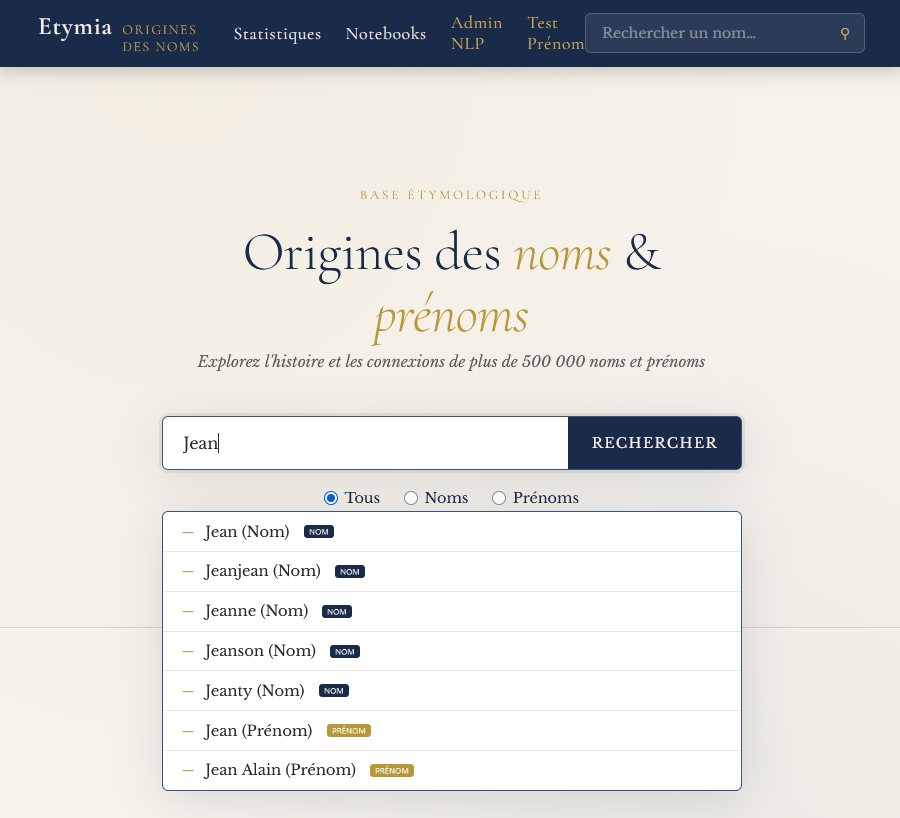
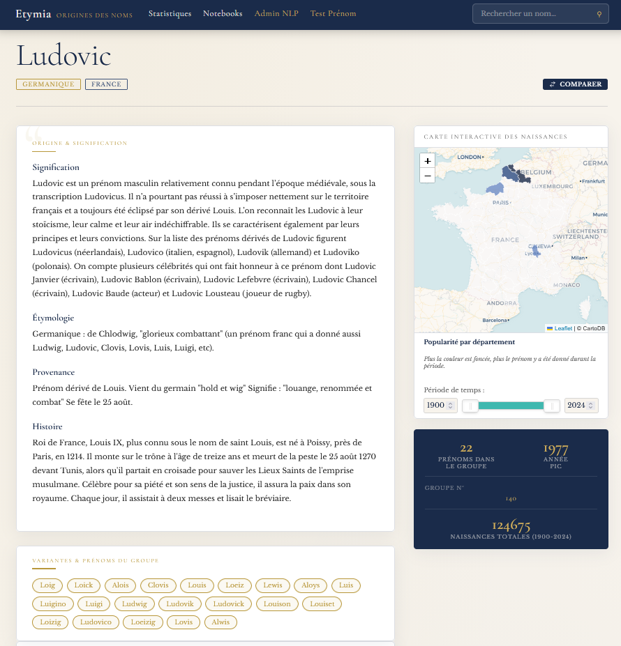
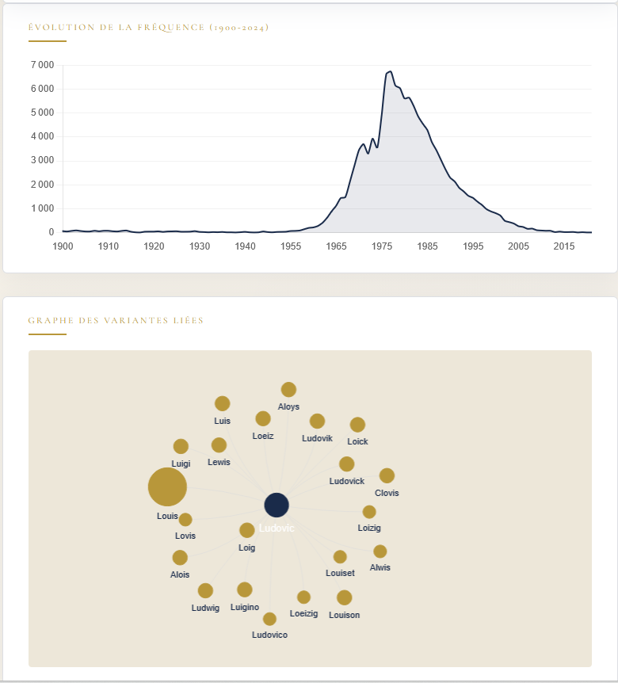
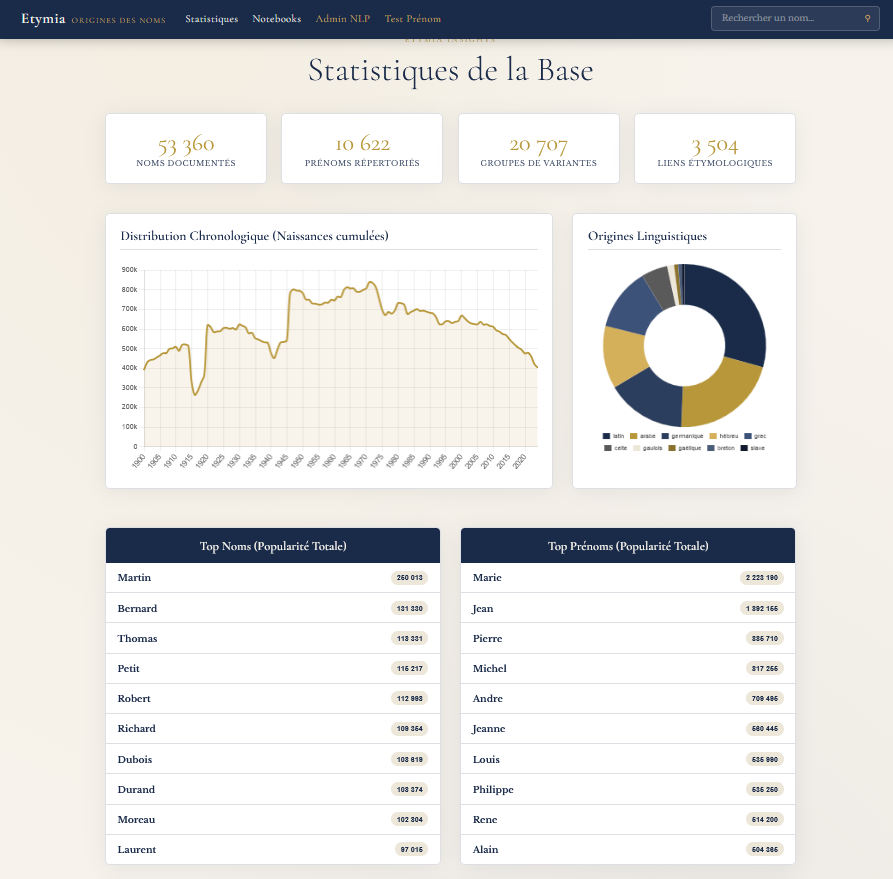
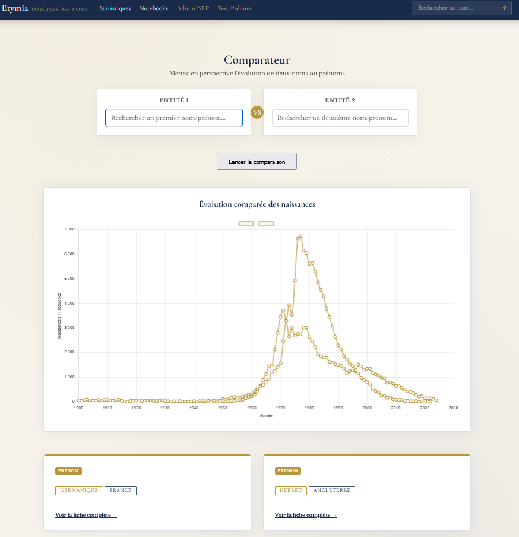
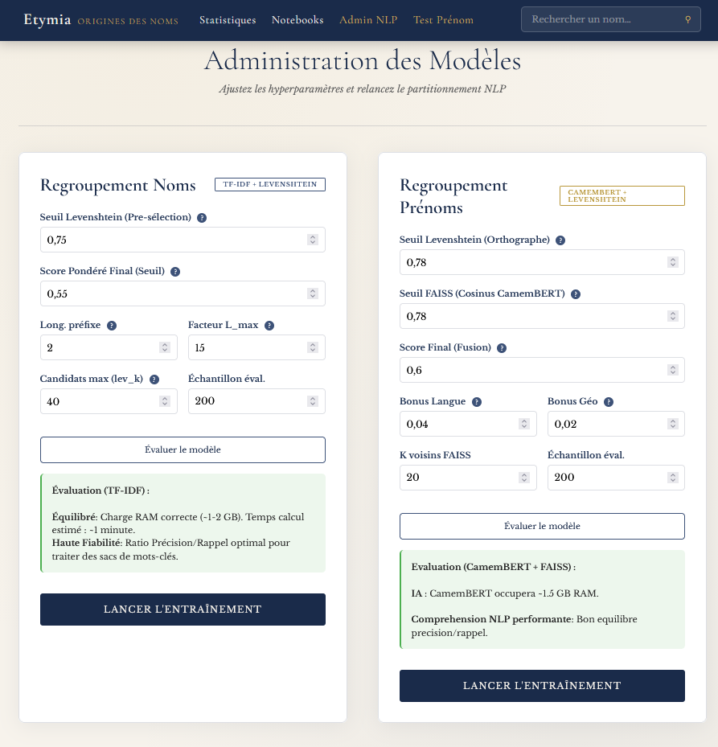

# Etymia — Pipeline NLP · Noms & Prénoms

**Etymia** est une plateforme complète de traitement onomastique utilisant des techniques avancées de NLP (embeddings, clustering sémantique, résumé automatique) pour nettoyer, regrouper et enrichir des données sur les noms de famille et prénoms français.

---

## Sommaire

- [Fonctionnalités clés](#-fonctionnalités-clés)
- [Techniques NLP employées](#-techniques-nlp-employées)
- [Architecture du Projet](#-architecture-du-projet)
- [Flux de données](#-flux-de-données)
- [Interface Web — Routes principales](#-interface-web--routes-principales)
  - [Accueil — Recherche (`/`)](#-accueil--recherche-)
  - [Fiche Prénom (`/prenom/<prenom>`)](#-fiche-prénom-prenomprenom)
  - [Statistiques Globales (`/stats`)](#-statistiques-globales-stats)
  - [Comparateur (`/compare`)](#️-comparateur-compare)
  - [Administration NLP — Regroupement (`/admin/regroupement`)](#️-administration-nlp--regroupement-adminregroupement)
  - [Test d'Intégration (`/admin/test_integration`)](#-test-dintégration-admintest_integration)
  - [Notebooks Jupyter (`/notebooks`)](#-notebooks-jupyter-notebooks)
- [Installation & Utilisation](#️-installation--utilisation)
- [Évaluation](#-évaluation)
- [Crédits](#crédits)

---

## Fonctionnalités clés

- **Exploration Sémantique** : Regroupement intelligent des noms et prénoms par origine étymologique et proximité phonétique.
- **Enrichissement Historique** : Intégration massive des données de l'INSEE (1891-2024) pour une analyse démographique précise.
- **Interface Interactive** : Visualisation des relations sous forme de graphes et de courbes de popularité dynamiques.
- **Administration NLP** : Tuning en direct des modèles et simulateur d'intégration pour tester de nouvelles données.
- **Analyse Exploratoire** : Intégration de notebooks Jupyter pour l'évaluation et l'exploration des données.
- **Pipeline Automatisé** : Scripts de traitement de bout en bout, de la collecte (scraping) à la mise en ligne.

---

## Techniques NLP employées

| Étape | Prénoms | Noms de Famille |
|---|---|---|
| **Nettoyage** | Regex, conservation casse | SpaCy, Lemmatisation |
| **Extraction Métadonnées** | Regex (langue, religion, géo, date) | Regex (origines, variantes) |
| **Liens Directs** | Levenshtein adaptatif (seuil 1–3) | Levenshtein + Regex sections |
| **Représentation** | CamemBERT (sentence-transformers, 768d) | TF-IDF vectorisé |
| **Recherche de similarité** | FAISS (IndexFlatIP, cosine) | Jaro-Winkler pairwise |
| **Clustering** | Union-Find (seuil ≥ 0.91) | Union-Find (seuil ≥ 0.55) |
| **Post-validation** | — | NER CamemBERT-NER |
| **Résumé** | Paraphrase (Camembert2Camembert) | Extractif (centroïde TF-IDF) |
| **Enrichissement** | INSEE Parquet (naissances 1900–2024) | INSEE DBF (1891–2000) |

---

## Architecture du Projet

```
Etymia/
│
├── run_pipeline.py               # Menu interactif : pilote les pipelines et le serveur web
├── requirements.txt              # Dépendances Python
├── Dockerfile                    # Image Docker pour déploiement
├── docker-compose.yml            # Orchestration : service web + pipeline
├── .dockerignore
│
├── noms/                         # Pipeline noms de famille
│   ├── 1_prepare_noms.py         # Nettoyage, SpaCy, Levenshtein → 1_noms_clean.json
│   ├── 2_regroupement_noms.py    # Clustering hybride (Jaro-Winkler + TF-IDF + NER)
│   ├── 3_summarize_noms.py       # Résumé extractif par centroïde TF-IDF
│   ├── 4_integrate_insee.py      # Jointure avec données historiques INSEE (DBF)
│   ├── evaluation_metrics.py     # Métriques : précision, rappel, F1, matrice confusion
│   ├── eda_noms.ipynb            # Analyse exploratoire des données noms
│   ├── evaluation_noms.ipynb     # Évaluation du modèle noms
│   └── data/
│       ├── 0_names.json          # Données brutes des noms (nom + liste d'origines)
│       ├── 0_origins.json        # Textes d'origine associés aux IDs
│       ├── 1_noms_clean.json     # Noms nettoyés + embeddings préliminaires
│       ├── 2_noms_grouped.json   # Noms avec groupes candidats
│       ├── 2_groupes_noms.json   # Structure des groupes noms (étape 2)
│       ├── 3_groupes_finals.json # Groupes finaux consolidés
│       ├── 3_noms_final.json     # Noms finaux avec résumés
│       ├── 4_noms_final_insee.json # Noms enrichis avec données INSEE de naissance
│       └── noms_insee/           # Fichiers DBF INSEE (données historiques)
│
├── prenoms/                      # Pipeline prénoms
│   ├── 1_prepare_prenoms.py      # Nettoyage, regex métadonnées, Levenshtein adaptatif
│   ├── 2_regroupement_prenoms.py # Clustering sémantique CamemBERT + FAISS
│   ├── 3_summarize_prenoms.py    # Paraphrase/synthèse (Camembert2Camembert)
│   ├── 4_enrichir_insee.py       # Jointure tendances INSEE (Parquet, maille dept.)
│   ├── evaluation_metrics.py     # Métriques d'évaluation propres aux prénoms
│   ├── eval_summarize.py         # Évaluation de la qualité des résumés
│   ├── python_debug.py           # Utilitaires de debug
│   ├── eda_prenoms.ipynb         # Analyse exploratoire des données prénoms
│   ├── evaluation_prenoms.ipynb  # Évaluation du modèle prénoms
│   ├── scrapping/
│   │   ├── 1_scrapping_global.py  # Scraping en masse des fiches Geneanet/autres
│   │   └── 2_scrapping_unitaire.py # Scraping ciblé prénom par prénom
│   ├── eval/                     # Données et résultats d'évaluation
│   └── data/
│       ├── 1_prenoms_detail.json  # Données brutes scrapées (histoire, étymologie…)
│       ├── 2_prenoms_clean.json   # Prénoms nettoyés + textes + métadonnées
│       ├── 3_embeddings.npy       # Vecteurs CamemBERT (768d) de tous les prénoms
│       ├── 3_prenoms_grouped.json # Prénoms avec groupes candidats
│       ├── 3_groupes_prenoms.json # Structure des groupes prénoms (étape 2)
│       ├── 4_prenoms_final.json   # Prénoms finaux : histoire, étymologie, provenance…
│       ├── 4_groupes_finals_prenoms.json # Groupes finaux de prénoms
│       ├── 5_prenoms_stats.parquet  # Stats brutes par prénom × année × département
│       ├── 5_prenoms_tendances.json # Tendances agrégées prêtes pour l'interface JS
│       ├── faiss.index            # Index FAISS (recherche vectorielle rapide)
│       ├── faiss_metadata.json    # Métadonnées associées à l'index FAISS
│       └── prenoms_insee/         # Fichiers Parquet INSEE (naissances 2024)
│
├── flask/                        # Interface Web
│   ├── app.py                    # Serveur Flask : routes, API, chargement des données
│   ├── templates/
│   │   ├── base.html             # Layout commun (nav, header, footer)
│   │   ├── search.html           # Page de recherche principale
│   │   ├── fiche.html            # Fiche détaillée nom de famille
│   │   ├── fiche_prenom.html     # Fiche détaillée prénom (histoire, INSEE, graphe…)
│   │   ├── stats.html            # Statistiques globales + graphiques
│   │   ├── compare.html          # Comparateur nom vs prénom
│   │   ├── explore.html          # Page d'exploration
│   │   ├── notebooks.html        # Liste des notebooks Jupyter
│   │   ├── notebook_view.html    # Visionneuse de notebook
│   │   ├── admin_regroupement.html     # Admin : lancement et tuning des modèles NLP
│   │   ├── admin_test_integration.html # Admin : test d'intégration d'un nouveau prénom
│   │   └── 404.html
│   └── static/                   # CSS, JS, assets statiques
│
├── data/                         # Données transverses (si applicable)
└── Evaluation_Modeles.ipynb      # Notebook global d'évaluation des deux pipelines
```

---

## Flux de données

```
[Scraping Web]
      │
      ▼
prenoms/data/1_prenoms_detail.json   noms/data/0_names.json + 0_origins.json
      │                                            │
      ▼                                            ▼
1_prepare_prenoms.py               1_prepare_noms.py
(nettoyage, regex, Levenshtein)    (SpaCy, lemmatisation, Levenshtein)
      │                                            │
      ▼                                            ▼
2_regroupement_prenoms.py          2_regroupement_noms.py
(CamemBERT + FAISS + Union-Find)   (TF-IDF + Jaro-Winkler + NER)
      │                                            │
      ▼                                            ▼
3_summarize_prenoms.py             3_summarize_noms.py
(Paraphrase Camembert2Camembert)   (Résumé extractif TF-IDF centroïde)
      │                                            │
      ▼                                            ▼
4_enrichir_insee.py                4_integrate_insee.py
(Parquet INSEE, tendances dept.)   (DBF INSEE, volumes 1891-2000)
      │                                            │
      └──────────────────┬─────────────────────────┘
                         ▼
                   flask/app.py
                  (Interface Web)
```
## Interface Web — Routes principales

---

### Accueil — Recherche (`/`)

La page d'accueil permet de rechercher un nom de famille **ou** un prénom via une barre de recherche avec autocomplétion dynamique (JSON). Elle détecte automatiquement les recherches combinées (ex. `Marie Dupont`) et propose un lien direct vers le comparateur. Les résultats affichent le type (nom / prénom), l'origine linguistique et géographique, ainsi qu'un court résumé.



---

### Fiche Prénom (`/prenom/<prenom>`)

La fiche d'un prénom concentre toutes les informations enrichies issues du pipeline NLP :
- Histoire, étymologie, signification et provenance géographique
- Graphe de groupe (prénoms liés, vis.js)
- Graphe de tendances INSEE (naissances par année et par département)
- Métadonnées : langue, religion, époque, variantes




---

### Statistiques Globales (`/stats`)

La page de statistiques offre une vue d'ensemble de la base de données :
- Compteurs globaux (noms, prénoms, groupes)
- Graphiques interactifs : distribution linguistique, répartition géographique, chronologie des naissances
- Top 10 des noms et prénoms les plus fréquents
- Prénoms "en tendance" (pic de popularité récent ≥ 2018)



---

### Comparateur (`/compare`)

La page de comparaison permet de mettre côte à côte un nom de famille et un prénom (ou deux entités du même type) sur une **chronologie unifiée**. Les courbes de popularité INSEE sont superposées sur un graphique Chart.js pour visualiser les évolutions croisées.



---

### Administration NLP — Regroupement (`/admin/regroupement`)

Interface d'administration permettant de relancer et de paramétrer les scripts de clustering NLP directement depuis le navigateur. Les hyperparamètres (seuils Levenshtein, sémantique, taille des groupes…) sont ajustables via des sliders, et les résultats (nombre de clusters, singletons, logs) sont affichés en temps réel.



---

### Test d'Intégration (`/admin/test_integration`)

Outil de simulation permettant de tester l'intégration d'un **nouveau prénom** sans modifier la base. L'utilisateur saisit un prénom et un texte descriptif ; le système calcule :
- Les liens Levenshtein potentiels
- La similarité sémantique (CamemBERT + FAISS)
- Les scores finaux et la décision `FUSION` / `REJET` par rapport aux groupes existants


---

### Notebooks Jupyter (`/notebooks`)

La page liste l'ensemble des notebooks Jupyter du projet (EDA, évaluation des modèles…) et permet de les visualiser directement dans le navigateur grâce à `nbconvert`, sans avoir besoin de lancer Jupyter localement.

---

### Tableau récapitulatif

| Route | Description |
|---|---|
| `/` | Recherche et autocomplétion |
| `/nom/<nom>` | Fiche détaillée d'un nom de famille |
| `/prenom/<prenom>` | Fiche détaillée d'un prénom (histoire, graphe, carte INSEE) |
| `/stats` | Statistiques globales + graphiques chronologiques et linguistiques |
| `/compare` | Comparaison croisée nom / prénom |
| `/notebooks` | Liste des notebooks Jupyter du projet |
| `/notebook/view?path=...` | Visionneuse de notebook (rendu via nbconvert) |
| `/admin/regroupement` | Interface de tuning des modèles NLP |
| `/admin/test_integration` | Test d'intégration d'un nouveau prénom avec scoring détaillé |

---

## Installation & Utilisation

### En local

```bash
# 1. Créer l'environnement
python -m venv .venv
.venv\Scripts\activate     # Windows
# ou: source .venv/bin/activate  # Linux/Mac

# 2. Installer les dépendances
pip install -r requirements.txt
python -m spacy download fr_core_news_sm

# 3. Lancer le gestionnaire de pipelines (interactif)
python run_pipeline.py

# 4. Ou lancer directement le serveur web
python flask/app.py
```

### Avec Docker

```bash
# Build et démarrage du serveur web
docker-compose up --build

# Lancer le pipeline de traitement dans le conteneur
docker-compose run pipeline python run_pipeline.py
```

---

## Évaluation

| Métrique | Prénoms | Noms |
|---|---|---|
| Précision | Calculée sur paires annotées | Calculée sur paires annotées |
| Rappel | Calculé sur paires annotées | Calculé sur paires annotées |
| F1-Score | Combinaison P/R | Combinaison P/R |
| Cohérence linguistique | % clusters mono-langue (objectif > 75%) | % clusters mono-origine |
| Confidence Score | Similarité cosinus intra-groupe | Score Jaro-Winkler moyen |

Les notebooks `evaluation_noms.ipynb` et `evaluation_prenoms.ipynb` permettent de reproduire l'évaluation complète avec matrices de confusion et courbes.

---

## Crédits
Jean-Corentin Loirat

*Projet réalisé dans le cadre du Master 2 NLP / Data Science — Sup de Vinci.*
